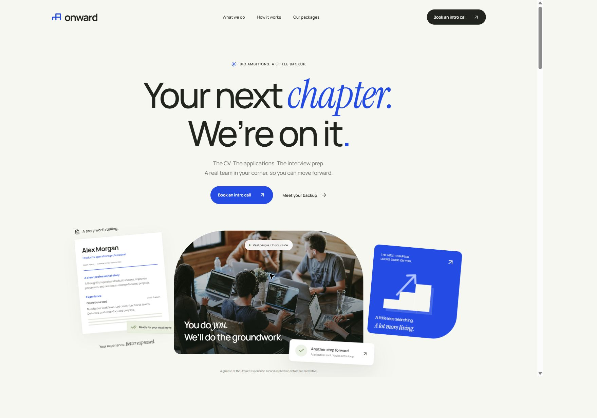

# Onward

A responsive landing-page concept for a personal job-search service. Onward is a working brand, ready to replace with the client's name and logo.

[Live website](https://onward-career.vercel.app) · [GitHub repository](https://github.com/Trust-Code-System/onward-career)



## Hosting

The project is configured for Vercel with the Vite framework, `npm run build` as the build command, and `dist` as the output directory. There are no environment variables or backend services to configure for this landing-page concept.

The Vercel project belongs to the `hello-76386237s-projects` workspace (Trustcode System) and is connected to this repository's `main` branch. Pushes to `main` trigger production deployments; other branches receive previews.

## Run locally

```sh
npm install
npm run dev -- --port 5173
```

Open http://localhost:5173. To build the static site, run `npm run build`; the output is in `dist/`. `npm run preview` serves that production build.

## What is included

- Editorial hero with local photography, CV sample, and a custom stair motif.
- Interactive CV comparison, service overview, process, illustrative tracker, package comparison, and FAQs.
- Responsive mobile navigation and a native intake-preview dialog with package selection, sample slots, validation, and an explicit preview summary.
- Keyboard tabs, focus return, Escape dismissal, scroll restoration, reduced motion, and local fonts.

This is a frontend concept. It does not book calls, collect customer information, charge payments, sign contracts, upload CVs, create accounts, or send applications. Package scope and marketing copy are proposed content. Prices, legal policies, customer results, business registration, and market positioning must be supplied or approved before launch.

## Files

- `src/App.tsx`: landing-page content and interactions.
- `src/styles.css`: design system, layout, responsive rules, and animation.
- `public/images/` and `public/fonts/`: locally hosted assets.
- `.ui-craft/`: design brief, tokens, surface specification, and review notes.
- `.better-web-ui.md`: reusable design context.
- `artifacts/`: local review screenshots (ignored by Git).

## Design and assets

Manrope is the upright UI face; Instrument Serif supplies display emphasis. Their SIL Open Font License files are in `public/fonts/licenses/`. Images were sourced from Unsplash for this concept. See `ATTRIBUTIONS.md` for source links. No image represents a verified employee, customer, or endorsement.

Before extending this site, confirm the client's real brand, prices/currency, customer market, booking/payment providers, contract, portal needs, content, budget, launch date, and maintenance arrangement.
